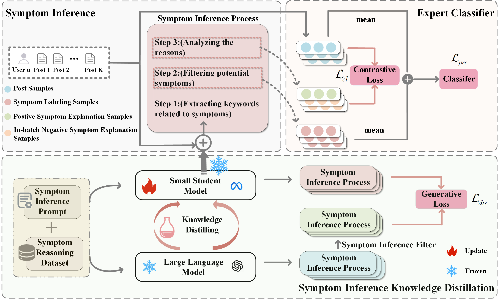

# Making Small Language Model Excellent Symptom Inference Expert for Mental Disorders Detection

SIE is a Symptom Inference Expert (SIE) by combining symptom inference knowledge distillation and expert classifier. 

## Model Architecture



The SIE model consists of three main components:
1. Post-level Encoder: Processes each social media post using BERT
2. Contrastive Learning Module: Performs post-level contrastive learning
3. User-level Classifier: Combines post embeddings with symptom features

## Features

- **BERT-based Text Encoding**: Utilizes `bert-base-uncased` for encoding social media posts.
- **Symptom Integration**: Incorporates symptom information for enhanced classification.
- **Contrastive Learning**: Employs contrastive learning to improve feature representation.
- **Classification**: Supports classification for multiple mental disorders detection.

## Functions

- **sie.py**: model.
- **extractsymfeature.py**: extract symptom feature.
- **main.py**: main function.
- **processdata**: process data.
- **samodel**: fine-tuned student symptom inference model.

## Installation

1. Clone the repository:
```bash
git clone https://github.com/yourusername/SIE.git
cd SIE
```

2. Create a virtual environment (recommended):
```bash
# Using conda
conda create -n sie python=3.8
conda activate sie

# Or using venv
python -m venv sie_env
source sie_env/bin/activate  # Linux/Mac
# or
sie_env\Scripts\activate  # Windows
```

3. Install dependencies:
```bash
pip install -r requirements.txt
```

4. Download pre-trained models:
```bash
# The required BERT model will be automatically downloaded when first running the code
```

## Usage

1. put data here 'processed/symp_sum_top' and Prepare your data:
```bash
python processdata/prepare_data.py
```

2. Train the model:
```bash
sh run.sh
```

